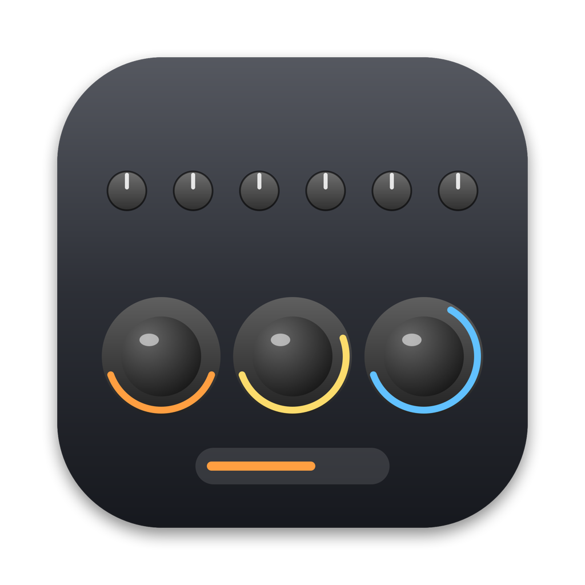
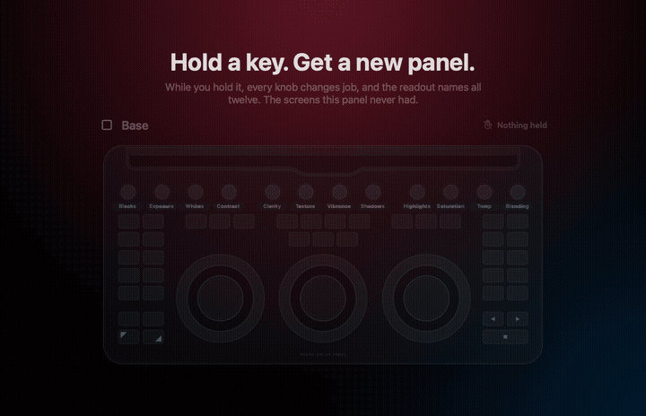
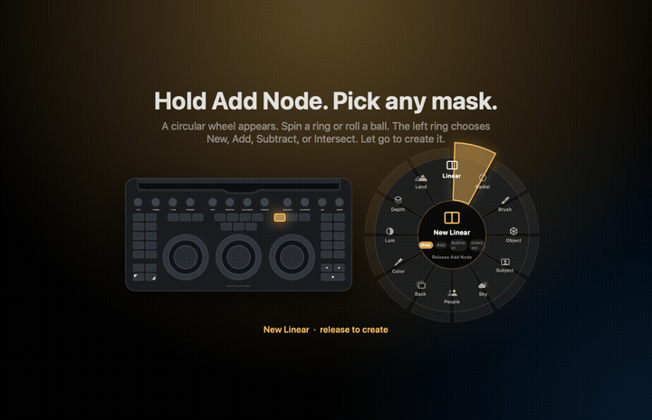
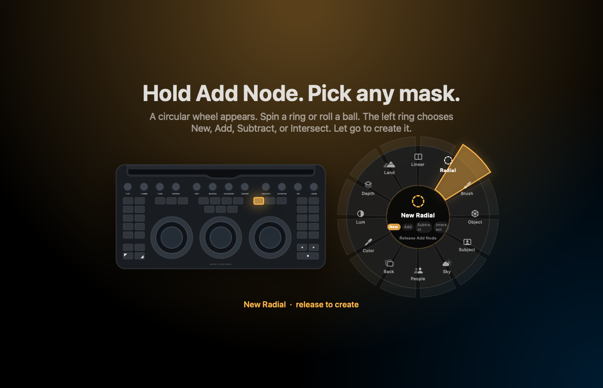
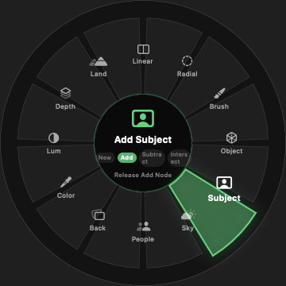
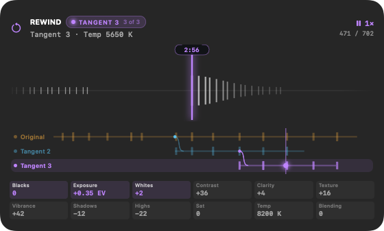
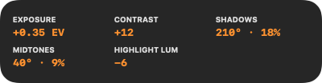

# PanaLux

**One panel. Every job.** Rewind+, tangents, and customizable controls.

[What changed in 1.2.0](RELEASE_NOTES.md) · [Downloads](https://github.com/AnotherMeatsack/panalux/releases/latest)

I bought a Micro Color Panel for Resolve. I also edit stills. I wanted the panel I already paid for to do more than one job.

PanaLux makes it work in Lightroom Classic. Turn the knobs, grade with the trackballs, and hold a key when you need a different set of controls. It lives in the macOS menu bar. Close the window and the panel keeps working.

> PanaLux is a free, unofficial, open-source macOS app. It is not affiliated with, endorsed by, or related to Blackmagic Design, Adobe, or Apple. It talks to a Micro Color Panel you already purchased and to Lightroom Classic through PanaLux Bridge, a lightly modified copy of the free community plugin MIDI2LR. You are not buying anything. The author is not selling the panel, Lightroom, or this software.


## What you need

macOS 14 or later, a Blackmagic Micro Color Panel connected over USB-C, and Lightroom Classic. PanaLux Bridge, the Lightroom plugin, installs from the app.

## Install

1. Download the ZIP or DMG from this repository's Releases page.
2. Extract the ZIP if needed, then drag PanaLux to Applications and open it.
3. PanaLux is not notarized. For the first launch, go to **System Settings > Privacy & Security > Open Anyway**.
4. Run the setup assistant. Install PanaLux Bridge, then check the Lightroom and panel connections. Grant Accessibility permission for functions such as Photoshop, copy/paste, and sync.

You can replay the intro from the menu bar. The hands-on tour advances when you actually turn a knob or hold a key. You can follow it with Lightroom on another display.

Updates from 1.2 onward are available through **Check for Updates…** in the menu bar or Settings. Versions before 1.2 need a manual upgrade first.

Open **Tangents** to name and compare versions or merge selected sliders into a new tangent. Both source versions survive. Masks and crop are excluded from selective slider merges.

## What the panel does

The starting map keeps the three trackballs on shadow, midtone, and highlight color. Each ball adjusts hue and saturation. The three rings adjust luminance for those same ranges.

From left to right, the twelve knobs control **Blacks, Exposure, Whites, Contrast, Clarity, Texture, Vibrance, Shadows, Highlights, Saturation, Temperature, and Color blending**.

The keys handle jobs such as copy, paste, undo, redo, previous/next photo, export, and the Photoshop round-trip.

Use both hands. Several knobs, all three balls, and the rings can move together. Lightroom updates as you work, and the readout can show up to six controls at once.

## Hold a key. Get a new panel.

Hold Up Shift and the first eight knobs become the eight Color Mixer bands. Let go and they return to their previous jobs. A tap can also leave a mode on until you tap again.

Turn on **Program Buttons** in the toolbar to assign without editing a photo. Press any physical button for **On tap**, or hold it for **While held**, then drop an action onto the key. Turn programming off when finished.

Every key has separate **On tap** and **While held** assignments. The table below is the factory map, not a fixed set of rules.



### Factory modes

| Key and gesture | What it does |
| --- | --- |
| **Hold Up Shift** | Color Mixer. Knobs 1-8 control Red, Orange, Yellow, Green, Aqua, Blue, Purple, and Magenta. Reset Lift, Reset Gamma, and Reset Gain select hue, saturation, and luminance. |
| **Hold User** | Upright and Transform. Knobs become perspective controls. Auto Color becomes Upright Auto while User is held. |
| **Tap or hold Cursor** | Masks. Knobs adjust the selected mask, keeping matching controls in their Base positions. You can turn that behavior off in Settings and build a custom mask layout. |
| **Hold Add Node** | Opens the circular mask tool wheel. Choose a tool and operation, then release to create it. Place it with the mouse. |
| **Hold Undo** | Rewind+. Scrub your whole editing session one change at a time, replay it, and branch it into tangents. Tap is still Undo. |
| **Hold Viewer** | Crop and Straighten. Knobs trim edges, the center ring straightens, and keys select aspect presets. |
| **Hold Select** | Cull in Library. Keys rate, flag, and color-label photos. Rings scroll photos and zoom. |
| **Tap Offset** | Temperature and tint on the rings, with global color on the right ball. |
| **Hold Down Shift** | Prev/Next Keyframe add photos to the selection, like Command-click. |
| **Hold Wipe Still** | Shows Before. Tap instead for side-by-side. |
| **Hold Auto Color** | Tone Curve, with parametric regions on the knobs. |
| **Hold H / Lite** | Detail, including sharpening and noise reduction. |
| **Hold Play Still** | Effects, including vignette, grain, and dehaze. |
| **Hold Grab Still** | Lens and Optics, including corrections and Lens Blur. Tap instead for the Photoshop round-trip. |
| **Tap Previous Still** | Gathers this photo into a bracket. Grab Still then sends the gathered frames. |
| **Hold Play** | Presets. Step through presets, adjust the amount, and trigger slots 1-10. Assign the Lightroom presets to those slots in the plugin options. |

## Hold Add Node. Pick a mask.

Hold Add Node and a circular tool wheel appears over Lightroom. Roll a ball to choose a tool. The lit wedge shows what you will get. Release Add Node to create it.



There are twelve tools: Linear, Radial, Brush, Object, Subject, Sky, People, Background, Color Range, Luminance, Depth, and Landscape.

Place the mask with the mouse. Knobs then grade that mask, with Exposure still on the Exposure knob and so on.

**Coming soon:** placing radial, linear, and brush masks with the trackballs and rings, so you can stay off the mouse. The wheel, the combine modes, and local knobs ship now.



### New, Add, Subtract, or Intersect

While the wheel is open, the left ring chooses New, Add, Subtract, or Intersect. Prev Node, Next Node, Prev Frame, and Next Frame can also select those operations. The center readout names the tool and operation before you release.



Once a mask is selected, the matching adjustment knobs stay in familiar positions. Other keys can move between masks, invert, hide, delete, or select subject and sky.

## Hold Undo. Rewind+.

Undo still undoes on a tap. Hold it and the whole editing session becomes a tape you can scrub, replay, and branch. (The plus is a joke. The feature isn't.)



You get lost in an edit. You want to see exactly where it went wrong, stop at the last place you liked, and start again from there without losing the other way you were going. That is what this does.

**The centre ring is a jog wheel.** One click is one thing you changed, so you can stop on the exact number you had, whether the session was thirty seconds or two hours. Turn faster and it accelerates to cross a long session; stop turning and it holds. The notch shows what changed at every step (`Exposure +0.35 EV`), where you are (`212 / 640`), and what all twelve knobs read right there.

**Play it back.** Play and Play Reverse replay your edits as they happened; press the same key again to pause, or use Stop. Long stretches where you were not touching anything play through in half a second. The left ring is a fine speed dial for slow motion and the right ring is a coarse one, from 0.05× to 32×, and both catch at 1×.

**Tangents.** Roll back, let go, and edit: that starts a tangent. The notch says so, and every readout wears that tangent's badge from then on, so you always know you are on a tangent. The other line is kept whole. Prev / Next Node hop between tangents at the same moment, so you can flip between where each one ended up. This is the part Lightroom's history panel cannot do.

This is not Lightroom's history panel. PanaLux records every develop value the plugin reports, whether a knob here or the mouse in Lightroom moved it, and captures a whole settings table around anything structural — a mask, a crop, a preset, a paste — so landing on one of those puts it back exactly.

While Undo is held:

| Control | Job |
| --- | --- |
| **Centre ring** | Jog through your changes, one click per step. Faster travels; stop to hold. |
| **Left ring** | Playback speed, fine. Slow motion. |
| **Right ring** | Playback speed, coarse. |
| **Play / Play Reverse** | Replay forward or backward. Same key again pauses. |
| **Stop** | Pause where you are. |
| **Prev / Next Node** | Hop to the previous or next tangent. |
| **Add Node** | Start a new tangent here. |
| **Add Keyframe** | Mark this — "I liked it". |
| **Prev / Next Keyframe** | Step to the previous or next landmark. |
| **Next Still** | Back to now. |
| **Wipe Still** | Hold to peek at now without leaving the past. |

Letting go of Undo leaves the photo wherever the playhead is, and that tangent is the one you are editing. You can stop anywhere.

The feel is yours to tune: **Settings > Rewind** has click size and spin speed, and they apply on the next turn.

The trail is kept per photo, under `~/Library/Application Support/PanaLux/Trails`, and survives quitting. Like every other control on the panel, all of the above is remappable — Rewind's commands are ordinary tiles in the catalog.

## Make the map yours

The main window is one drawing of the panel. Click a control or touch it on the hardware, and the inspector follows. Search the catalog of **999 Lightroom commands** from MIDI2LR. Drag a command tile onto a knob or key. Every control can be remapped.

Each key has an On tap job and a While held job. A hold can activate a mode, make adjustments slower with Fine, show a comparison, put a focused slider on the knobs, open the mask wheel, or do nothing.

**Press a key.** Some things in Lightroom only exist as a keyboard shortcut. Any key can type one for you: **Before / After (Toggle)** in the Workspace & View Modes category types Lightroom's `\` key, so a button flips to Before and back again with one press. Give a key that tile as its hold job and it is Before while you hold and After when you let go. Under the hood it is a command like any other, `key:\`, and other shortcuts work the same way: `key:shift+e`, `key:cmd+opt+z`. It needs the same Accessibility permission as the Photoshop round-trip.

Copy, paste, or swap controls. Undo map edits with Command-Z and redo with Shift-Command-Z. Use the editing picker to work on Base or any mode without holding its key down.

Command-K finds a command so you can run it once, assign it, see where it is mapped, or temporarily put it on a knob. Hover a key to see arrows to the knobs and wheels it affects. If a mode is held, the hover view shows that mode's map rather than Base.

## Readout

The Micro Color Panel has no screens. PanaLux puts a small readout under the menu bar, below the camera notch where there is one, on Lightroom's display.


It shows the value you are changing, a spinning knob or ring, and a vectorscope for trackballs. While you hold a mode, it can list all twelve knob names. The Color Mixer can show its eight color dots.

Move several controls and the readout follows up to six at once.



**HOLD** means the mode ends when you let go. **ON** means you tapped it on.

Choose Full, Minimal, or Hidden. Set the readout to tuck away after 2, 4, 8, 15, or 30 seconds, or leave it until the next change.

## Working on several photos

Bypass selects all photos in the filmstrip. Disable opens Sync Settings; press it again to click Synchronize. Copy and Paste handle Develop settings. Undo, Redo, and Reset are available too.

Previous Still gathers photos into a bracket for the Photoshop round-trip. See [Gathering a bracket](#gathering-a-bracket).

These actions use Lightroom's menus and shortcuts, so macOS asks for Accessibility permission.

## Safety

**Pause Output** stops commands from reaching Lightroom. The readout still shows what would have happened.

**Safe Setup** lets you preview knob adjustments on screen without changing the photo. Held keys still work. Use Pause Output when you need all Lightroom output stopped.

**Back to Base** turns every mode off. It is also available from the menu bar.

PanaLux reads the current value from Lightroom before moving a slider rather than starting it at zero. It makes map backups at launch and before an import, preset, or reset. If Lightroom is missing or a control is unmapped, the readout says so.

At the end of the hands-on tour, choose **Keep Changes** or **Put the Photo Back**.

## Photoshop

Tap Grab Still to open the selected photos as layers in Photoshop. PanaLux waits for the whole stack to arrive, then auto-aligns it once. Blend, then tap Grab Still again: it flattens, saves, and brings Lightroom forward. This round-trip needs Accessibility permission.

Auto-align can be turned off in Settings, and **Auto-Align Layers** can be put on its own key.

Holding Grab Still does a different job: it opens the Lens and Optics controls.

### Gathering a bracket

Lightroom's arrow keys always collapse a selection down to one photo, so there is no way to build a scattered selection from the keyboard. Marking photos is different: it never disturbs what is selected.

Walk the filmstrip with Next and Previous. Tap **Previous Still** on each frame you want and skip the ones you don't — one, two, three, skip four, five, six. The readout counts them as you go, and tapping a frame again drops it. Then press Grab Still: only the gathered frames open as layers, aligned, and the bracket empties.

This is useful when a bracket has a frame you don't want, such as one where the camera moved. **Show Bracket** and **Clear Bracket** can go on any key.

Marking uses Lightroom's target collection, which is the Quick Collection unless you have set another one.

## DaVinci Resolve

When Resolve is open, PanaLux releases the panel so Resolve can use it. PanaLux takes the panel back when Resolve quits. The handoff follows whether Resolve is open, not which window is in front.

There is also an option to quit Resolve automatically. It is off by default.

## Share your maps

**Maps → Export Map** writes a `.panalux.json` file. That file is the whole setup: every knob, ring, ball, key, and mode, plus Fine speed, mask knob layout, and key calibration. It also includes a readable `readme` list of what each control does, so you can open it in a text editor.

Drop a map on the PanaLux window, or choose **Maps → Import**. Importing backs up your current map first. **Copy Map** puts the same file on the clipboard so you can paste it into a message.

You can also print a Reference Card for the current map, including every mode.

Preset, Keywords, Key 1-40, and Command Series slots are defined in Lightroom under **File > Plug-in Extras > General options**. PanaLux triggers those slots. A Command Series such as Auto Tone, then Upright, then Lens Corrections can live on one key.

Post the maps you build. I'd like to see what people put under their hands for different kinds of photography.

## Report a bug

Menu bar or Help → **Report a Bug**. Write what happened. PanaLux opens a GitHub issue with version, connections, and the active mode already filled in, and puts a copy of your map in Finder so you can attach it.

## Build from source

Requires Xcode 26 or later.

```bash
./Scripts/build_app.sh     # PanaLux.app (universal, ad-hoc signed, plugin included)
./Scripts/create_dmg.sh    # PanaLux-<version>.dmg for a release
swift test                 # unit tests
swift Scripts/make_icon.swift .   # regenerate the app icon (then iconutil, see script)
Scripts/make_bridge_plugin.sh /path/to/MIDI2LR.lrplugin   # refresh the bundled plugin from a MIDI2LR release
```

Quit PanaLux before rebuilding. Only one copy can use the panel.

### Layout

```
Sources/PanaLux/
  App/        launch, setup, tour, resource and file locations
  Hardware/   USB HID input and key lights
  Bridge/     engine (holds, modes, readout), Lightroom connection, Photoshop round-trip
  Model/      map format, factory map, command catalog, backups
  UI/         Map window, inspector, settings, command palette, notch readout
  Resources/  panel drawing, command list, factory map
Packaging/
  PanaLux Bridge.lrplugin   the Lightroom plugin PanaLux installs (GPL-3.0, see its NOTICE.txt)
```

## Troubleshooting

- **Lightroom shows "waiting."** Install the plugin from Settings, restart Lightroom, and quit the MIDI2LR app if it's open. That app holds the plugin's connection.
- **Panel not found.** Use a data-capable USB-C cable. If Resolve is open, the panel is with Resolve.
- **A knob does nothing.** The readout says why: not mapped, Lightroom not connected, or output paused.
- **Something feels stuck.** Use Back to Base in the menu bar.

## License

MIT for the PanaLux app. See [LICENSE](LICENSE).

The bundled Lightroom plugin, PanaLux Bridge, is GPL-3.0 because it is based on [MIDI2LR](https://github.com/rsjaffe/MIDI2LR). See [THIRD_PARTY_NOTICES.md](THIRD_PARTY_NOTICES.md).
