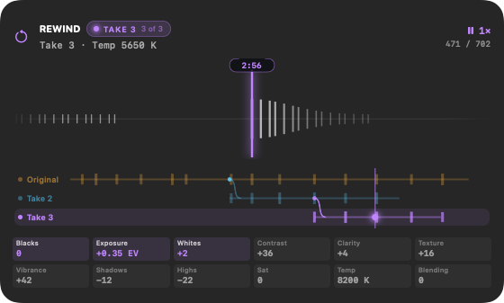

# PanaLux v1.1.0

**Now featuring Rewind+.** Hold Undo and watch your edit un-edit itself. Then branch it.

## Rewind+

Undo still undoes on a tap. Hold it and the whole editing session becomes a tape you can scrub, replay, and branch. (The plus is a joke. The feature isn't.)

- **The centre ring is a jog wheel.** One click is one thing you changed, so you can stop on the exact number you had, in a thirty-second edit or a two-hour one. Turn faster and it accelerates smoothly to cross a long session; stop turning and it holds.
- **Play it back.** Play and Play Reverse replay your edits as they happened. The same key again pauses; Stop pauses too. Long quiet stretches play through in half a second. The left ring is a fine speed dial and the right a coarse one, 0.05× to 32×, both catching at 1×.
- **Takes.** Edit from a rolled-back moment and a new take starts, with a notice, and every readout wears that take's badge while you are on it. The line you left is kept whole. Prev / Next Node hop between takes at the same moment, or from the end of one to the end of the next, so you can flip between where each finished.
- **A timeline worth looking at.** A large readout on a display-rate timeline: the playhead glides on a critically damped spring, the ticks under it swell and blip with each step, the tape re-zooms to how densely you were editing, and every take is a lane with forks curving off. The panel widens for it and grows with the number of takes. The notch shows what changed at each step, where you are among them, and what all twelve knobs read there.
- **Tune the feel** in Settings > Rewind: click size and spin speed apply on the next turn.
- **Landmarks and nothing lost.** A whole settings table is captured around a mask, crop, preset, or paste, so landing on one restores it exactly. Rolling back never truncates the future. Add Keyframe marks a moment; Wipe Still peeks at now; Next Still returns to it.

The trail is kept per photo under `~/Library/Application Support/PanaLux/Trails` and survives quitting. Every part of the gesture is remappable, like every other control on the panel.

## Fixed

- **Temperature no longer stops at 3000 K.** The Lightroom plugin, inherited from MIDI2LR, squeezed Temperature into a 3000-9000 K window, so after Auto Color the knob could not go warmer than 3000 K. It also made the notch's Kelvin readout wrong. Temperature now spans Lightroom's own 2000-50000 K, the readout matches Lightroom, and the knob feels exactly as it did.
- **Grab Still round-trip is reliable.** Photoshop is addressed by document id rather than whatever is frontmost, the hand-off waits for every layer before aligning, and the flatten comes back to Lightroom from a real Photoshop document.
- **Lightroom stays in front when Grab Still fires.**
- **Shareable maps.** Export writes the full setup as one `.panalux.json` anyone can drop on PanaLux.
- **In-app bug reports.**

## Upgrading

Your map is kept. The new Rewind keys are added to it only where you had not already given a key a job. Update the Lightroom plugin from the app when PanaLux asks, then restart Lightroom: Rewind needs the new PanaLux Bridge, and the Temperature fix lives in it.

Requires macOS 14 or later, a USB-C Micro Color Panel, and Lightroom Classic.

> PanaLux is a free, unofficial, open-source macOS app. It is not affiliated with, endorsed by, or related to Blackmagic Design, Adobe, or Apple. It talks to a Micro Color Panel you already purchased and to Lightroom Classic through PanaLux Bridge, a lightly modified copy of the free community plugin MIDI2LR. You are not buying anything. The author is not selling the panel, Lightroom, or this software.

MIT for the app. PanaLux Bridge is GPL-3.0 because it is based on MIDI2LR.
